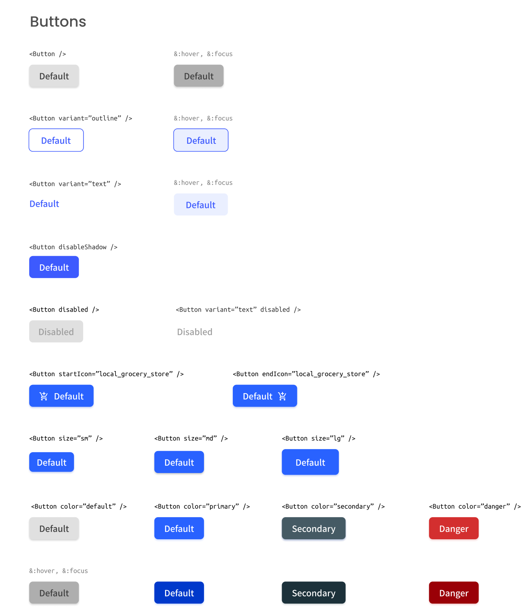

# Button component

**React Challenge:** Create a reusable button with all the states in the design and a page displaying all the states.

### User stories fullfilled: ###

- There are different button types: *`default`*, *`outline`* and *`text`*
- We can choose to disable *`box-shadow`*
- We can choose to disable button
- We can choose to have an icon on the left or right (Use Google Icon and at least 5 variants)
- We can have different button sizes
- We can have different colors
- When we hover or focus, we can see visual indicators
- We access all button attributes 

